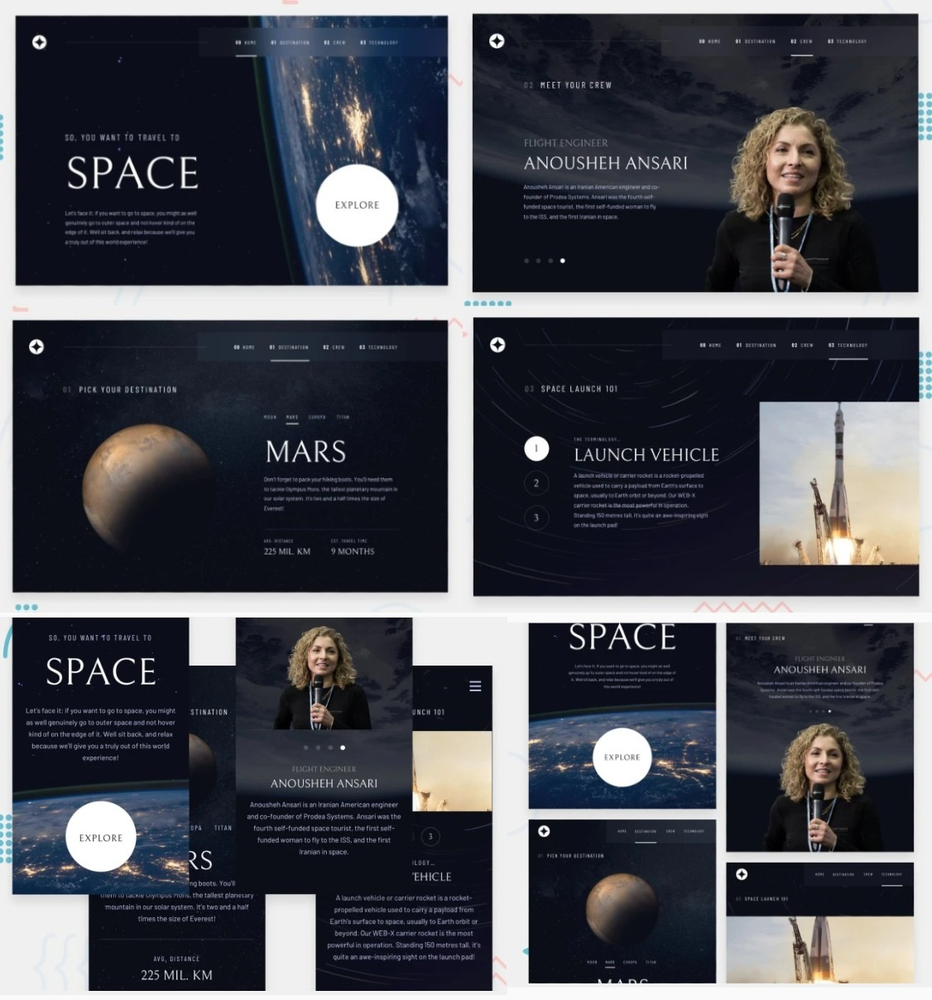

# Frontend Mentor - Space tourism website solution

This is my solution to the [Space tourism website challenge on Frontend Mentor](https://www.frontendmentor.io/challenges/space-tourism-multipage-website-gRWj1URZ3)

## The challenge

Users should be able to:

- View the optimal layout for each of the website's pages depending on their device's screen size
- See hover states for all interactive elements on the page
- View each page and be able to toggle between the tabs to see new information

### Links

- Solution URL: [Add solution URL here](https://www.frontendmentor.io/challenges/space-tourism-multipage-website-gRWj1URZ3)
- Live Site URL: [Add live site URL here]()

### Built with

- Mobile-first (Layout)
- React-JS
- React-Router-6
- Framer-Motion
- SCSS-Modules

## Author

- Created by - okayda-jhon
